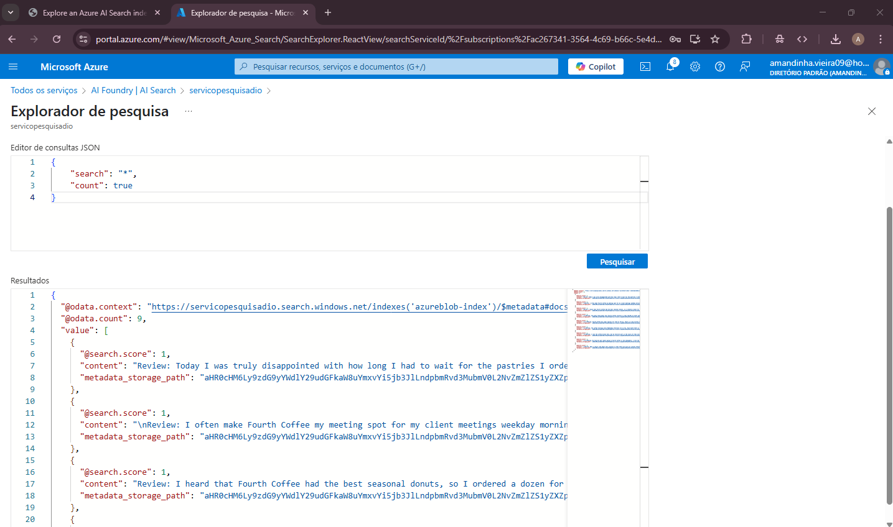
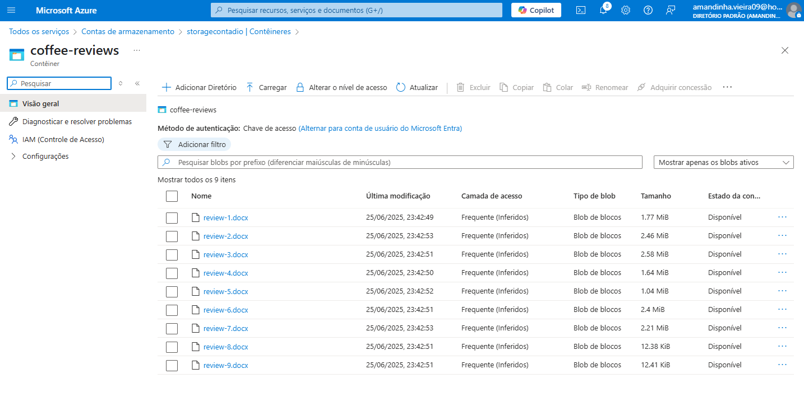

# Utilizando AI Search para indexação e consulta de Dados

Este laboratório tem como objetivo aplicar técnicas de organização e pesquisa de documentos por meio da ingestão de dados e indexação utilizando ferramentas de inteligência artificial. Durante as aulas, foram abordados três passos principais: ingestão de conteúdo para IA, criação de índices inteligentes e exploração prática dos dados organizados. O foco está em desenvolver uma compreensão sólida sobre como essas ferramentas podem ser utilizadas para minerar e extrair conhecimento de grandes volumes de informação. Como entregável, espera-se um repositório estruturado contendo registros das etapas realizadas e insights obtidos ao longo da prática.

Recurso Útil: [Explore an Azure AI Search index (UI)](https://microsoftlearning.github.io/mslearn-ai-fundamentals/Instructions/Labs/11-ai-search.html) - Laboratório no Microsoft Learning

Pesquisa com IA (Cognitive Search): Para indexar e buscar conteúdo de forma inteligente.

Contas de armazenamento (Azure Storage): Utilizado para armazenar os documentos que seriam analisados e indexados.

Insights:
-  A combinação entre armazenamento em nuvem, IA e automação permite escalar facilmente a análise de grandes volumes de documentos.
- A automação garante atualização constante dos dados sem intervenção manual.
- A IA melhora significativamente a precisão e a utilidade das buscas, indo além de simples palavras-chave.

 
